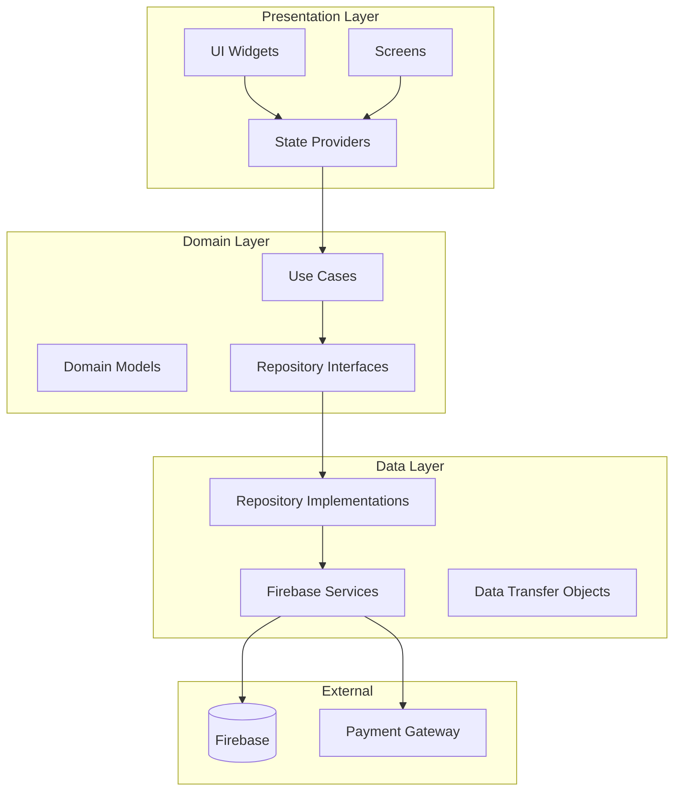
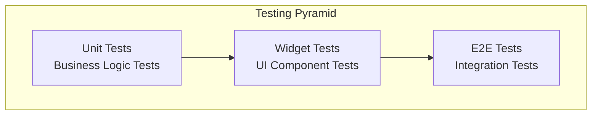

# Design Document

## Overview

워크샵 & 대관 예약 관리 앱은 Clean Architecture 원칙을 따르는 Flutter 앱으로, Firebase를 백엔드로 사용합니다. 미니멀하고 직관적인 Material Design 3를 기반으로 하며, 유지보수성과 확장성을 고려한 모듈형 구조로 설계됩니다.

### 핵심 설계 원칙
- **단일 책임 원칙**: 각 클래스와 모듈은 하나의 명확한 책임을 가집니다
- **의존성 역전**: 추상화에 의존하여 테스트 가능하고 유연한 구조를 만듭니다
- **관심사 분리**: UI, 비즈니스 로직, 데이터 계층을 명확히 분리합니다
- **재사용성**: 공통 컴포넌트와 유틸리티를 통해 코드 중복을 최소화합니다

## Architecture

### 전체 아키텍처 다이어그램



### 계층별 구조

#### 1. Presentation Layer (lib/presentation/)
- **Screens**: 각 화면별 UI 구현
- **Widgets**: 재사용 가능한 UI 컴포넌트
- **Providers**: 상태 관리 (Provider 패턴 사용)
- **Theme**: 일관된 디자인 시스템

#### 2. Domain Layer (lib/domain/)
- **Models**: 비즈니스 엔티티
- **Repositories**: 데이터 접근 인터페이스
- **Use Cases**: 비즈니스 로직 캡슐화

#### 3. Data Layer (lib/data/)
- **Services**: Firebase 서비스 구현
- **Repositories**: Repository 인터페이스 구현
- **DTOs**: 데이터 전송 객체

## Components and Interfaces

### 1. 인증 시스템

```dart
// Domain Model
class User {
  final String id;
  final String email;
  final String name;
  final UserRole role;
  final DateTime createdAt;
}

// Repository Interface
abstract class AuthRepository {
  Future<User?> signIn(String email, String password);
  Future<User> signUp(String email, String password, String name);
  Future<void> signOut();
  Stream<User?> get authStateChanges;
}

// Use Case
class SignInUseCase {
  final AuthRepository _repository;
  
  Future<Result<User>> execute(String email, String password) async {
    // 비즈니스 로직 구현
  }
}
```

### 2. 워크샵 관리 시스템

```dart
// Domain Model
class Workshop {
  final String id;
  final String title;
  final String description;
  final double price;
  final int capacity;
  final String? imageUrl;
  final List<String> tags;
  final DateTime createdAt;
}

// Repository Interface
abstract class WorkshopRepository {
  Future<List<Workshop>> getWorkshops({WorkshopFilter? filter});
  Future<Workshop> getWorkshopById(String id);
  Future<void> createWorkshop(Workshop workshop);
  Future<void> updateWorkshop(Workshop workshop);
  Future<void> deleteWorkshop(String id);
}
```

### 3. 예약 및 결제 시스템

```dart
// Domain Models
class TimeSlot {
  final String id;
  final DateTime date;
  final TimeOfDay startTime;
  final TimeOfDay endTime;
  final SlotType type;
  final String? itemId; // workshop ID for workshop slots
  final bool isAvailable;
  final int maxCapacity;
  final int currentBookings;
}

class Booking {
  final String id;
  final String userId;
  final String timeSlotId;
  final BookingType type;
  final String? itemId;
  final BookingStatus status;
  final double totalAmount;
  final PaymentInfo? paymentInfo;
  final DateTime createdAt;
}

class PaymentInfo {
  final String paymentId;
  final PaymentMethod method;
  final PaymentStatus status;
  final DateTime paidAt;
  final String? receiptUrl;
}
```

### 4. 상태 관리 구조

```dart
// Provider 기반 상태 관리
class AuthProvider extends ChangeNotifier {
  final AuthRepository _authRepository;
  User? _currentUser;
  
  User? get currentUser => _currentUser;
  bool get isAuthenticated => _currentUser != null;
  bool get isAdmin => _currentUser?.role == UserRole.admin;
}

class WorkshopProvider extends ChangeNotifier {
  final WorkshopRepository _repository;
  List<Workshop> _workshops = [];
  WorkshopFilter _currentFilter = WorkshopFilter.empty();
  
  List<Workshop> get workshops => _workshops;
  WorkshopFilter get currentFilter => _currentFilter;
}
```

## Data Models

### Firebase Firestore 컬렉션 구조

```dart
// Firestore 문서 구조
class UserDto {
  final String email;
  final String name;
  final String role;
  final Timestamp createdAt;
  
  Map<String, dynamic> toFirestore() => {
    'email': email,
    'name': name,
    'role': role,
    'createdAt': createdAt,
  };
}

class WorkshopDto {
  final String title;
  final String description;
  final double price;
  final int capacity;
  final String? imageUrl;
  final List<String> tags;
  final Timestamp createdAt;
  
  // Firestore 변환 메서드
}
```

### 데이터 변환 계층

```dart
// DTO to Domain Model 변환
extension UserDtoExtension on UserDto {
  User toDomain(String id) => User(
    id: id,
    email: email,
    name: name,
    role: UserRole.values.byName(role),
    createdAt: createdAt.toDate(),
  );
}
```

## Error Handling

### 통합 에러 처리 시스템

```dart
// Result 패턴을 사용한 에러 처리
sealed class Result<T> {
  const Result();
}

class Success<T> extends Result<T> {
  final T data;
  const Success(this.data);
}

class Failure<T> extends Result<T> {
  final AppException exception;
  const Failure(this.exception);
}

// 앱 전용 예외 클래스
abstract class AppException implements Exception {
  final String message;
  final String? code;
  const AppException(this.message, {this.code});
}

class AuthException extends AppException {
  const AuthException(super.message, {super.code});
}

class NetworkException extends AppException {
  const NetworkException(super.message, {super.code});
}
```

### 에러 처리 미들웨어

```dart
class ErrorHandler {
  static void handleError(AppException exception) {
    // 로깅
    Logger.error(exception.message, exception: exception);
    
    // 사용자에게 적절한 메시지 표시
    switch (exception.runtimeType) {
      case AuthException:
        _showAuthError(exception as AuthException);
        break;
      case NetworkException:
        _showNetworkError(exception as NetworkException);
        break;
      default:
        _showGenericError(exception);
    }
  }
}
```

## Testing Strategy

### 테스트 피라미드 구조



### 1. Unit Tests
- **Domain Models**: 비즈니스 로직 검증
- **Use Cases**: 비즈니스 규칙 테스트
- **Repositories**: 데이터 접근 로직 테스트
- **Utilities**: 헬퍼 함수 테스트

### 2. Widget Tests
- **Individual Widgets**: 각 위젯의 렌더링과 상호작용
- **Screen Tests**: 화면별 UI 동작 검증
- **Provider Tests**: 상태 변화 테스트

### 3. Integration Tests
- **User Flows**: 전체 사용자 여정 테스트
- **Firebase Integration**: 실제 백엔드 연동 테스트

### Mock 및 Test Doubles

```dart
// Repository Mock
class MockAuthRepository extends Mock implements AuthRepository {}

// Test 예시
void main() {
  group('SignInUseCase', () {
    late MockAuthRepository mockRepository;
    late SignInUseCase useCase;
    
    setUp(() {
      mockRepository = MockAuthRepository();
      useCase = SignInUseCase(mockRepository);
    });
    
    test('should return user when credentials are valid', () async {
      // Given
      const email = 'test@example.com';
      const password = 'password123';
      final user = User(id: '1', email: email, name: 'Test User');
      
      when(() => mockRepository.signIn(email, password))
          .thenAnswer((_) async => user);
      
      // When
      final result = await useCase.execute(email, password);
      
      // Then
      expect(result, isA<Success<User>>());
      expect((result as Success<User>).data, equals(user));
    });
  });
}
```

## UI/UX Design System

### 1. 디자인 토큰

```dart
class AppTheme {
  // 색상 시스템
  static const ColorScheme lightColorScheme = ColorScheme(
    brightness: Brightness.light,
    primary: Color(0xFF6750A4),
    onPrimary: Color(0xFFFFFFFF),
    secondary: Color(0xFF625B71),
    onSecondary: Color(0xFFFFFFFF),
    // ... 추가 색상
  );
  
  // 타이포그래피
  static const TextTheme textTheme = TextTheme(
    displayLarge: TextStyle(
      fontSize: 57,
      fontWeight: FontWeight.w400,
      letterSpacing: -0.25,
    ),
    headlineLarge: TextStyle(
      fontSize: 32,
      fontWeight: FontWeight.w400,
    ),
    // ... 추가 텍스트 스타일
  );
  
  // 간격 시스템
  static const double spacingXs = 4.0;
  static const double spacingSm = 8.0;
  static const double spacingMd = 16.0;
  static const double spacingLg = 24.0;
  static const double spacingXl = 32.0;
}
```

### 2. 재사용 가능한 컴포넌트

```dart
// 기본 버튼 컴포넌트
class AppButton extends StatelessWidget {
  final String text;
  final VoidCallback? onPressed;
  final AppButtonType type;
  final bool isLoading;
  
  const AppButton({
    required this.text,
    this.onPressed,
    this.type = AppButtonType.primary,
    this.isLoading = false,
    super.key,
  });
  
  @override
  Widget build(BuildContext context) {
    return FilledButton(
      onPressed: isLoading ? null : onPressed,
      child: isLoading 
        ? const SizedBox(
            width: 20,
            height: 20,
            child: CircularProgressIndicator(strokeWidth: 2),
          )
        : Text(text),
    );
  }
}

// 입력 필드 컴포넌트
class AppTextField extends StatelessWidget {
  final String label;
  final String? hint;
  final TextEditingController? controller;
  final String? Function(String?)? validator;
  final bool obscureText;
  final TextInputType keyboardType;
  
  // 구현...
}
```

### 3. 반응형 레이아웃

```dart
class ResponsiveLayout extends StatelessWidget {
  final Widget mobile;
  final Widget? tablet;
  final Widget? desktop;
  
  const ResponsiveLayout({
    required this.mobile,
    this.tablet,
    this.desktop,
    super.key,
  });
  
  @override
  Widget build(BuildContext context) {
    return LayoutBuilder(
      builder: (context, constraints) {
        if (constraints.maxWidth >= 1200) {
          return desktop ?? tablet ?? mobile;
        } else if (constraints.maxWidth >= 768) {
          return tablet ?? mobile;
        } else {
          return mobile;
        }
      },
    );
  }
}
```

## Performance Optimization

### 1. 이미지 최적화
- **Cached Network Image**: 네트워크 이미지 캐싱
- **Image Compression**: 업로드 전 이미지 압축
- **Lazy Loading**: 필요할 때만 이미지 로드

### 2. 상태 관리 최적화
- **Selective Rebuilds**: 필요한 위젯만 리빌드
- **Provider Scoping**: 적절한 범위의 Provider 사용
- **Immutable Data**: 불변 데이터 구조 사용

### 3. 네트워크 최적화
- **Request Caching**: API 응답 캐싱
- **Pagination**: 대용량 데이터 페이지네이션
- **Offline Support**: 오프라인 상태 처리

## Security Considerations

### 1. 인증 및 권한
- **Firebase Auth**: 안전한 사용자 인증
- **Role-based Access**: 역할 기반 접근 제어
- **Token Validation**: JWT 토큰 검증

### 2. 데이터 보안
- **Firestore Rules**: 데이터베이스 보안 규칙
- **Input Validation**: 사용자 입력 검증
- **Sensitive Data**: 민감한 정보 암호화

### 3. 결제 보안
- **PCI Compliance**: 결제 정보 보안 표준 준수
- **Secure Communication**: HTTPS 통신
- **Payment Tokenization**: 결제 정보 토큰화